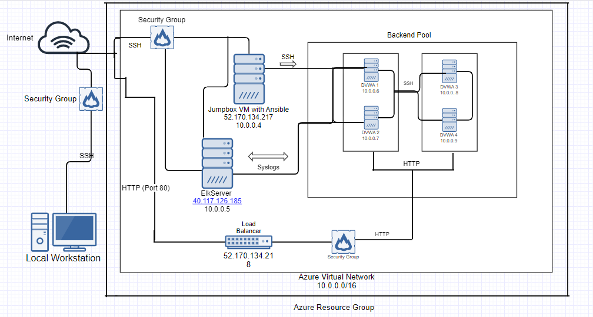

## Automated ELK Stack Deployment

The files in this repository were used to configure the network depicted below.

These files have been tested and used to generate a live ELK deployment on Azure. They can be used to either recreate the entire deployment pictured above. Alternatively, select portions of the [filebeat.yml](https://github.com/spatzmic/Cloud-Security/blob/master/filebeat.yml) file may be used to install only certain pieces of it, such as Filebeat.

This document contains the following details:
- Description of the Topology
- Access Policies
- ELK Configuration
  - Beats in Use
  - Machines Being Monitored
- How to Use the Ansible Build

### Description of the Topology

The main purpose of this network is to expose a load-balanced and monitored instance of DVWA, the D*mn Vulnerable Web Application.

Load balancing ensures that the application will be highly **redundant**, in addition to restricting **unauthorized access** to the network.

Integrating an ELK server allows users to easily monitor the vulnerable VMs for changes to the **filelogs, event logs** and **system metrics**.

The configuration details of each machine may be found below.
_Note: Use the [Markdown Table Generator](http://www.tablesgenerator.com/markdown_tables) to add/remove values from the table_.

| Name     | Function  | IP Address | Operating System |
|----------|-----------|------------|------------------|
| Jump Box | Gateway   | 10.0.0.4   | ubuntu severs    |
| DVWA1    | Webserver | 10.0.0.6   | ubuntu servers   |
| DVWA2    | Webserver | 10.0.0.7   | ubuntu servers   |
| DVWA3    | Webserver | 10.0.0.8   | ubuntu servers   |
| DVWA4    | Webserver | 10.0.0.9   | ubuntu serves    |
| ElkServer| Elkserver | 10.0.0.5   | ubuntu servers   |

### Access Policies

The machines on the internal network are not exposed to the public Internet. 

Only the **Jumpbox** machine can accept connections from the Internet.  Access to this machine is only allowed from the following IP addresses: **99.240.221.*** ** 

Machines within the network can only be accessed by the **Jumpbox 10.0.0.4**

A summary of the access policies in place can be found in the table below.

| Name     | Publicly Accessible | Allowed IP Addresses |
|-----------|---------------------|---------------------|
| Jump Box  |    no               | 99.240.221.***      |
|  DVWA1    |    no               | 10.0.0.6            |
|  DVWA2    |    no               | 10.0.0.7            |
|  DVWA3    |    no               | 10.0.0.8            |
|  DVWA4    |    no               | 10.0.0.9            |
| Elkserver |    no               | 10.0.0.5            |

### Elk Configuration

Ansible was used to automate configuration of the ELK machine. No configuration was performed manually, which is advantageous because it is **less time consumin, less repetitive, and eliminates human error**

The playbook implements the following tasks:

-Install the docker
-Install Python 
-Increase virtual memory of VM server
-Download and install docker sepb/elk

The following screenshot displays the result of running `docker ps` after successfully configuring the ELK instance.

(https://github.com/spatzmic/Cloud-Security/blob/master/Ansible%20Images/Docker%20PS.png)

### Target Machines & Beats
This ELK server is configured to monitor the following machines: ()priv ip add of dvwa()
- _TODO: List the IP addresses of the machines you are monitoring_

We have installed the following Beats on these machines:
- _TODO: Specify which Beats you successfully installed_ ()Filebeat, Metricbeat()

These Beats allow us to collect the following information from each machine:
- _TODO: In 1-2 sentences, explain what kind of data each beat collects, and provide 1 example of what you expect to see. E.g., `Winlogbeat` collects Windows logs, which we use to track user logon events, etc._ ()Filebeat collects log files.  Metricbeat collects system metrics such as uptime()

### Using the Playbook
In order to use the playbook, you will need to have an Ansible control node already configured. Assuming you have such a control node provisioned: 

SSH into the control node and follow the steps below:
- Copy the _ansible.cfg____ file to _/etc/ansible___.
- Update the __ansible.cfg file___ file to include the remote user and update the host file to include the webserver and elkserver...
- Run the playbook, and navigate to _elkserver public ip with port 5601__ to check that the installation worked as expected.

_TODO: Answer the following questions to fill in the blanks:_
- _Which file is the playbook? Where do you copy it?_ playbook.yml to /etc/ansible
- _Which file do you update to make Ansible run the playbook on a specific machine?  The host File. How do I specify which machine to install the ELK server on versus which to install Filebeat on?_ private Ip from elkservers and webservers
- _Which URL do you navigate to in order to check that the ELK server is running?

_As a **Bonus**, provide the specific commands the user will need to run to download the playbook, update the files, etc._

ansible-playbook elkinstall.yml
